# 📊 Gadget Solution Project Diagrams (Mermaid Version)

Dokumen ini berisi visualisasi arsitektur, alur data, skema database, dan linimasa proyek Gadget Solution menggunakan sintaksis **Mermaid.js**. Kode ini dapat di-render langsung oleh VS Code, GitHub, atau peninjau Markdown modern lainnya.

---

## 1. Core Components

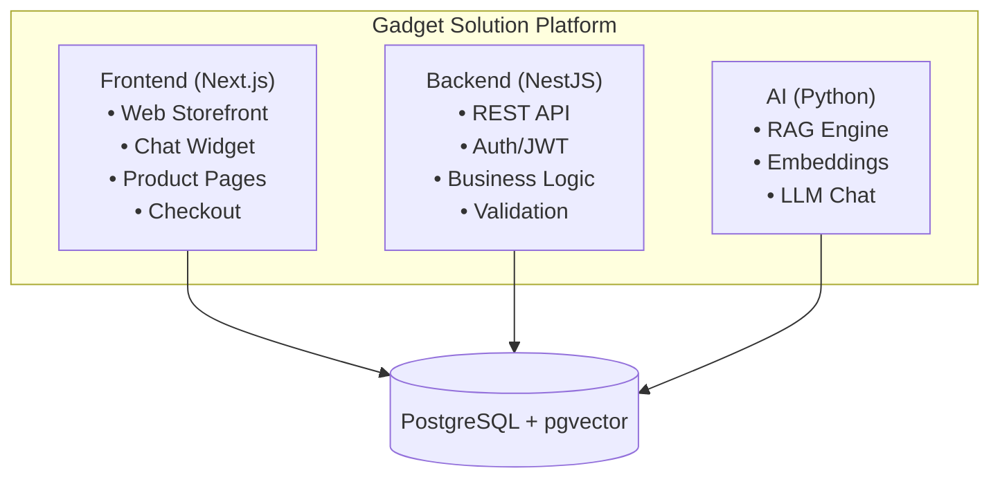

---

## 2. High-Level System Architecture

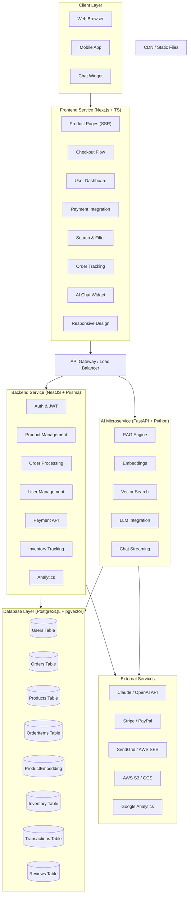

---

## 3. Frontend Architecture

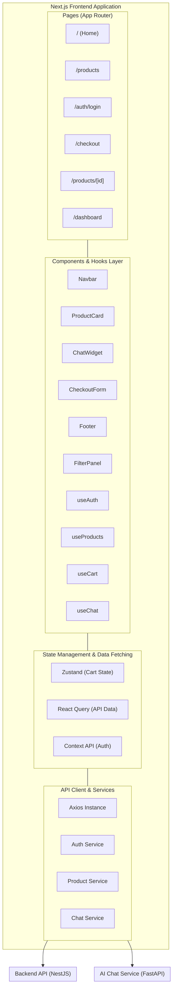

---

## 4. Backend Service Architecture

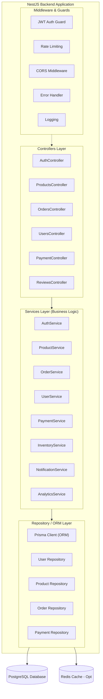

---

## 5. AI Service Architecture

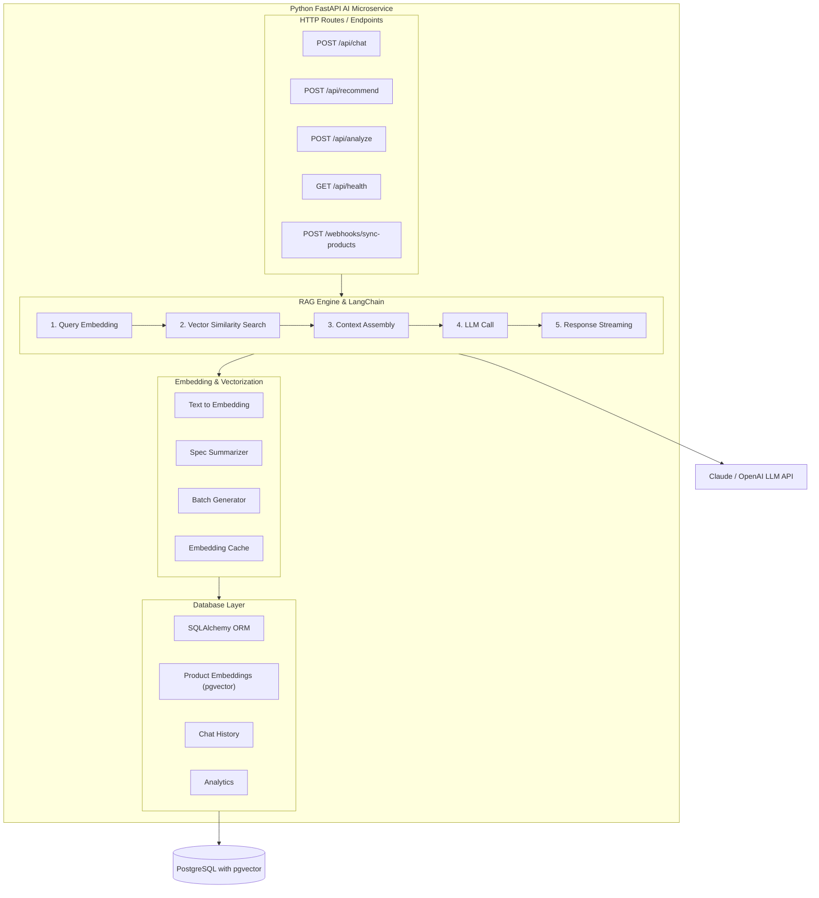

---

## 6. Database Schema ERD

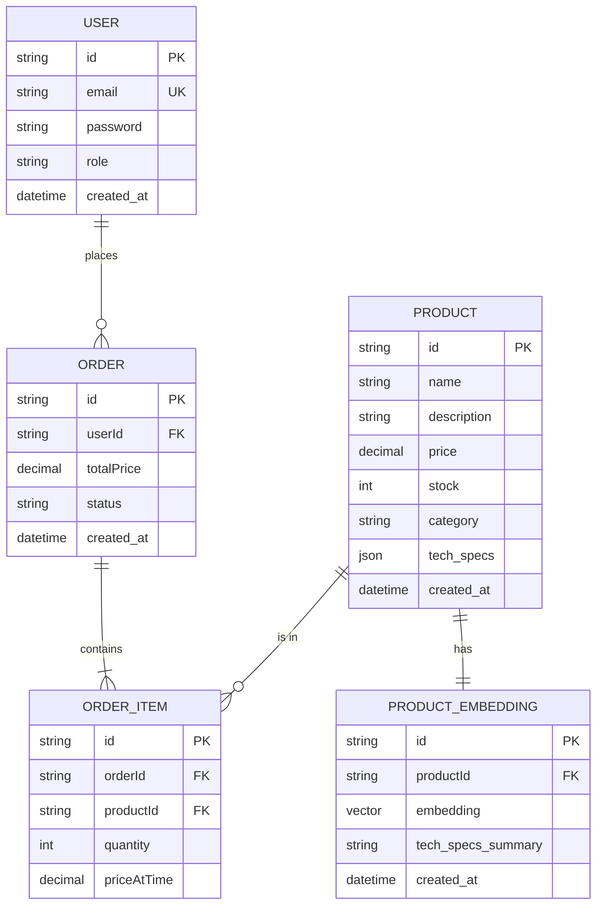

---

## 7. User Registration Flow

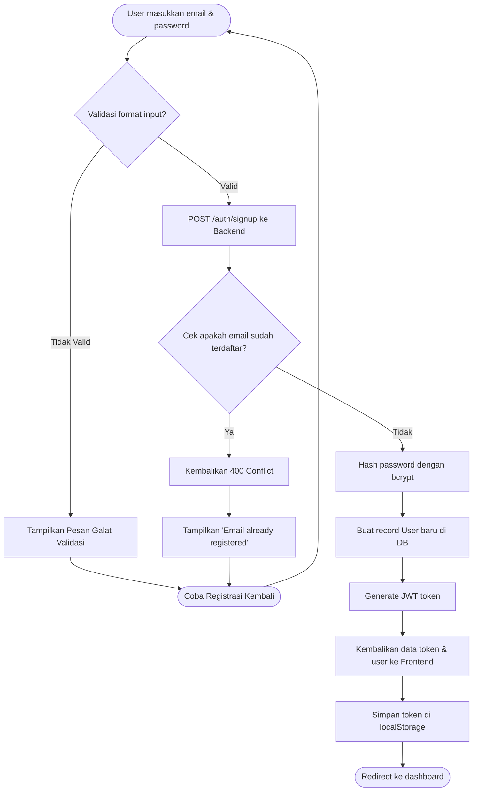

---

## 8. AI Consultant Recommendation Flow

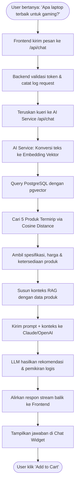

---

## 9. Checkout & Order Processing Flow

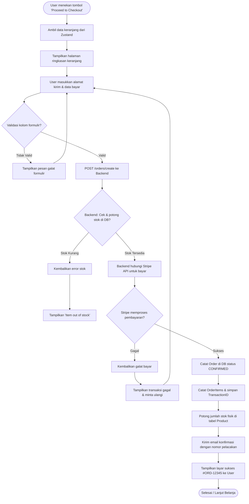

---

## 10. Product Embedding & Indexing Pipeline

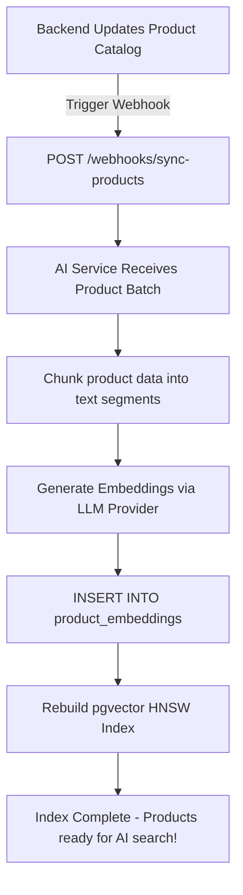

---

## 11. Admin Dashboard Analytics Flow

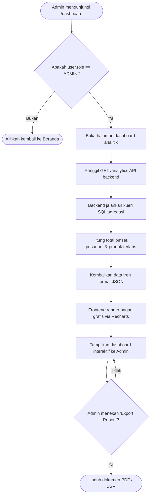

---

## 12. Project Timeline & Milestones

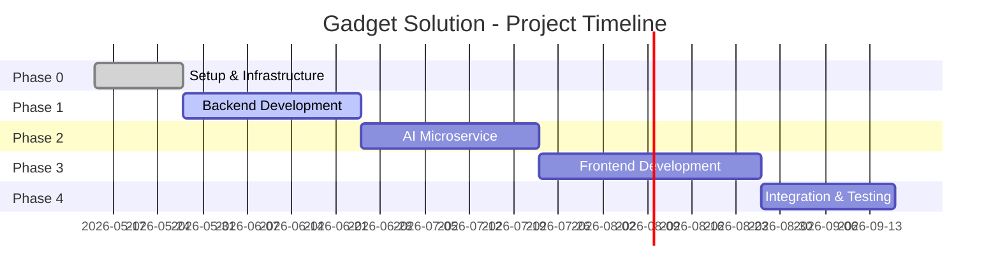

---

## 📊 Diagram Tambahan untuk Kebutuhan Website (Requirements)

Berikut adalah kumpulan diagram pelengkap industri standar yang sangat berguna untuk presentasi teknis, dokumentasi akademik, atau pemahaman rinci fungsionalitas e-commerce.

---

### A. Use Case Diagram

Menjelaskan kaitan hak akses (Actor) terhadap fitur-fitur inti di dalam sistem.

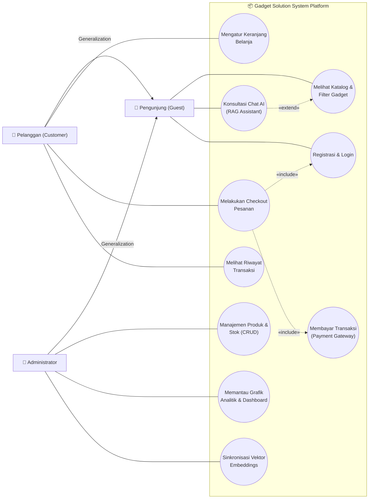

---

### B. Peta Situs & Navigasi Frontend (Sitemap)

Struktur rute (*routing structure*) dari aplikasi Next.js 14.

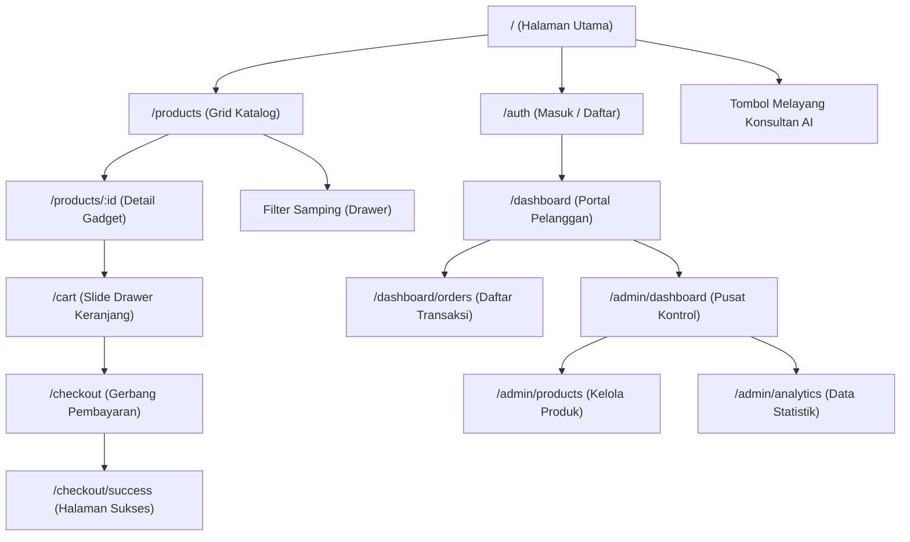

---

### C. Diagram Status Transaksi & Pembayaran (State Diagram)

Menjelaskan transisi status pesanan sejak checkout dibuat hingga pengiriman selesai.

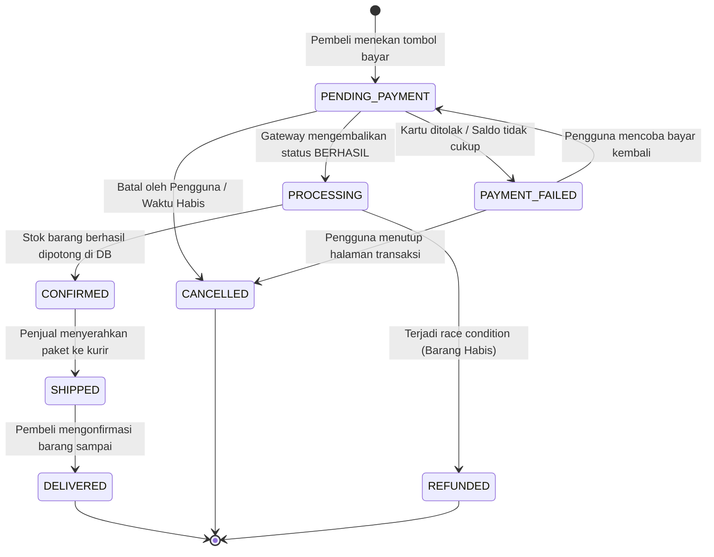

---

### D. Diagram Alir Data (Data Flow Diagram - DFD Level 1)

Menggambarkan bagaimana data mengalir di antara Entitas Luar, Proses Internal, dan Tempat Penyimpanan Data (*Data Store*).

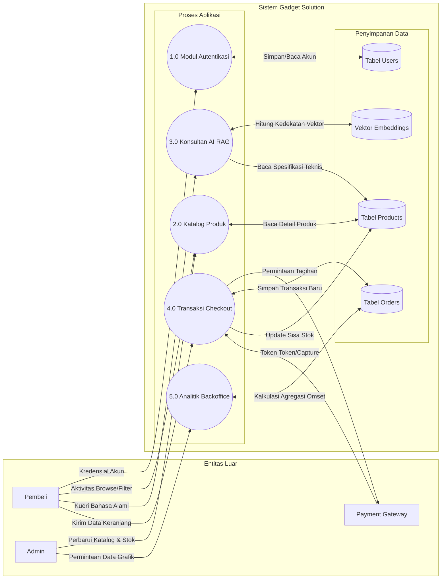

---

### E. Arsitektur Keamanan & Alur Token JWT (Security & Session)

Urutan validasi request yang aman dengan mekanisme *Access Token* (jangka pendek) dan *Refresh Token* (jangka panjang).

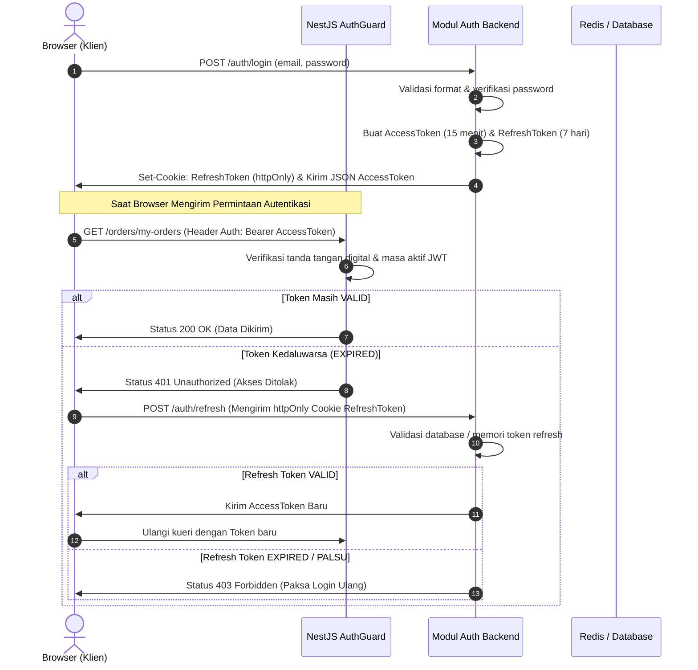

